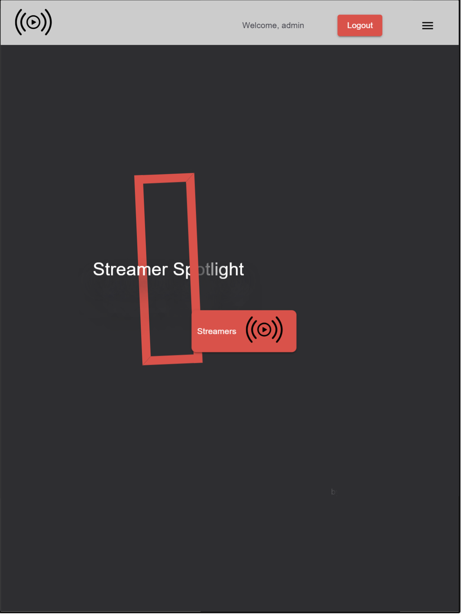
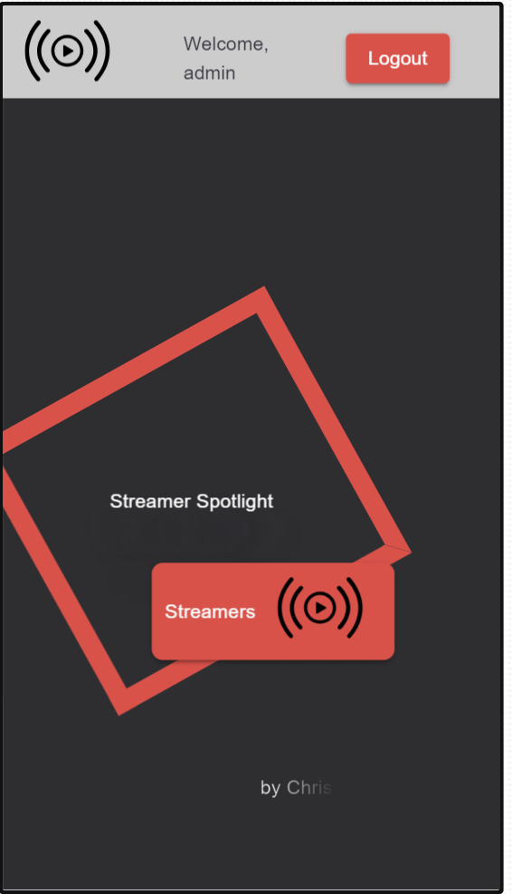
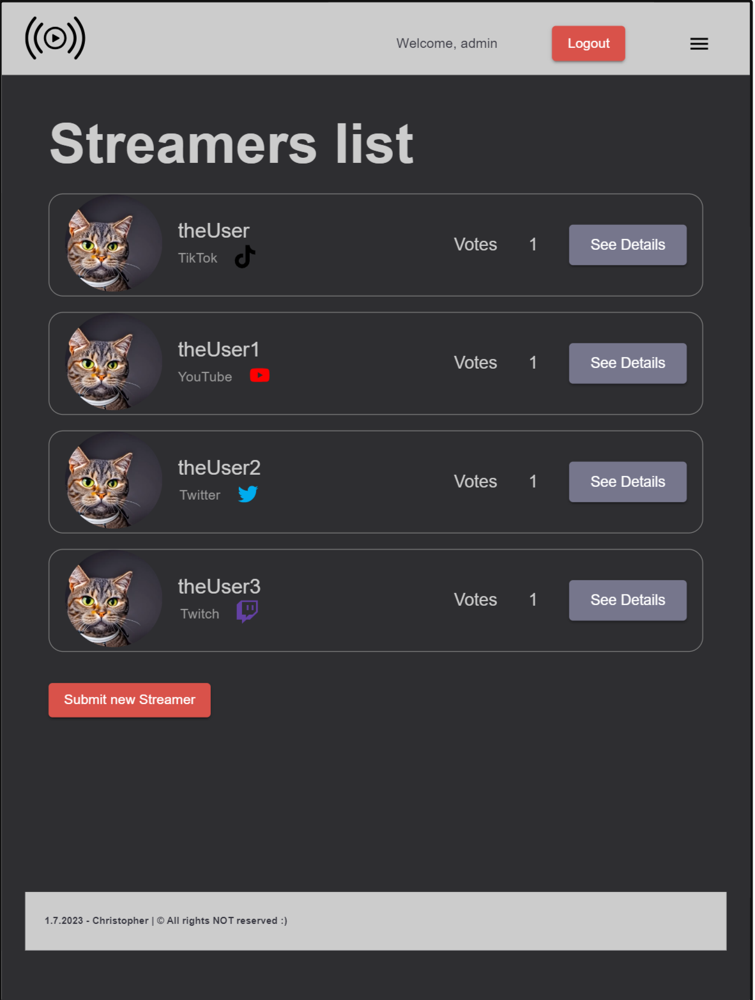
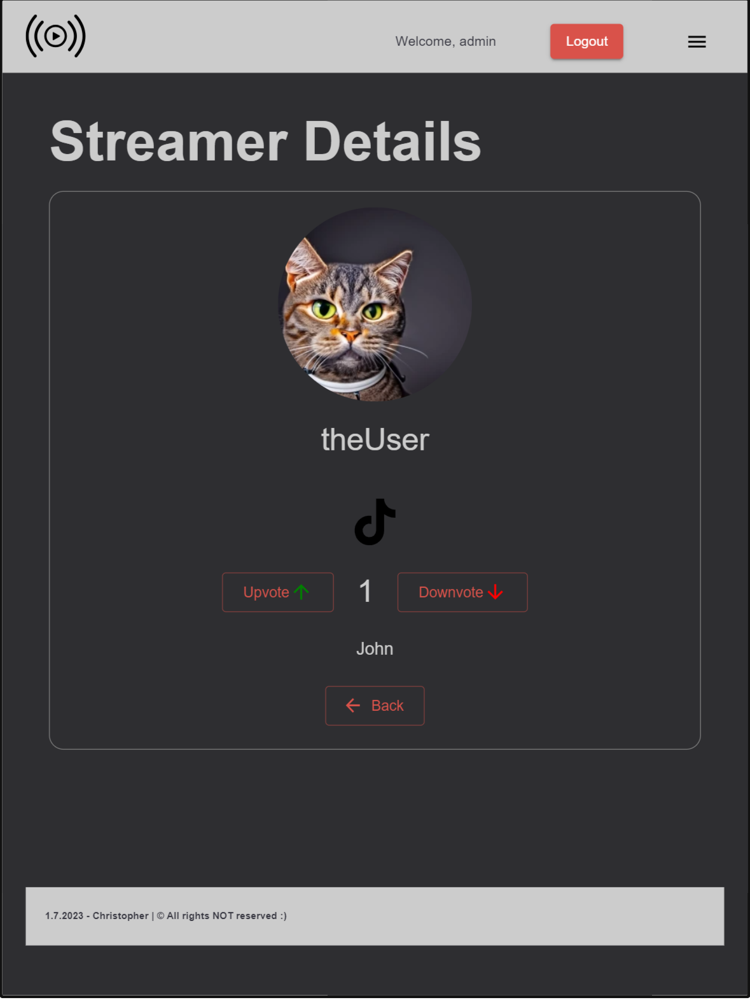

# Streamer Spotlight

This project is a full stack application to show and edit streamers, built using React.js, Vite, TypeScript, Node.js, Express and SQLite. The app provides basic information about the streamers with functionality to upvote or downvote any streamer.

## Table of Contents

- [Streamer Spotlight](#streamer-spotlight)
  - [Table of Contents](#table-of-contents)
  - [Features](#features)
  - [Main configurations](#main-configurations)
  - [Usage](#usage)

## Features

- Responsive design for desktop and mobile devices
- Overview of Streamer Spotlight services and expertise

Add more features specific to your project.

## Main configurations

FRONTEND

- React.js 18+ with TypeScript;
- ESLint;
- Prettier;
- MaterialUI
- log4js;

BACKEND

- Node.js
- Express.js
- SQLite

## Usage

Before you begin, ensure you have [Node.js](https://nodejs.org/) and [npm](https://www.npmjs.com/) installed on your system.

1. Clone this repository
2. Go to `front` directory
3. Run `npm install`
4. Go to the `backend` directory
5. Run `npm install`
6. Cd ito the `./newServer/sqlite/` directory
7. Run `node import` - it will initialize and fed db with sample data from `data.json`
8. Run `npm run start` to run backend server
9. Go to `front` directory
10. Run `npm run dev` to run frontend
11. Enjoy!

License

This project is licensed. See the LICENSE file for more information.
